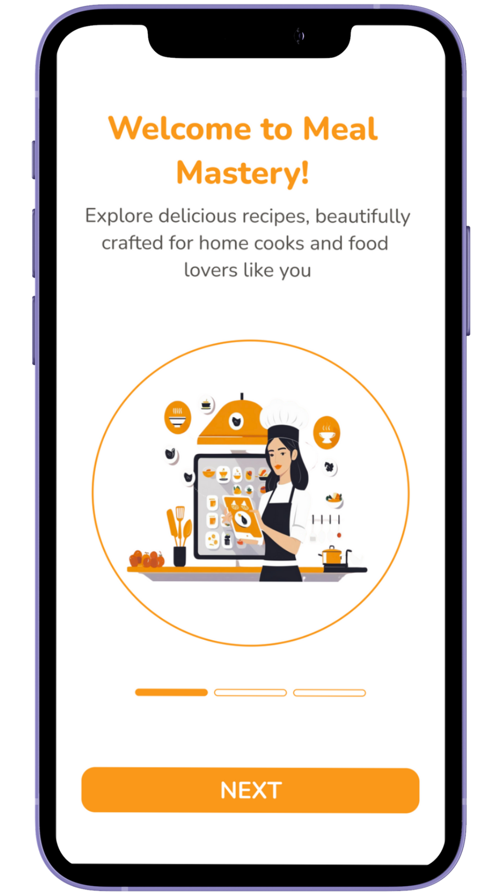

# 🍽️ Meal Mastery - UI/UX Design

**Meal Mastery** is a thoughtfully crafted UI/UX design project for a modern mobile food recipe application, developed using Figma. This app is built to deliver a seamless, inspiring, and visually appealing user experience for cooking enthusiasts, home chefs, and anyone who enjoys discovering and organizing recipes.

The project focuses on simplicity, warmth, and functionality — providing users with an intuitive way to browse, save, and submit recipes with clean navigation and attractive visuals. From welcoming users with engaging onboarding screens to allowing them to add personalized recipe content, Meal Mastery creates a cohesive and user-centered design journey from start to finish.

This project demonstrates my proficiency in creating end-to-end mobile interfaces, applying design principles such as consistency, hierarchy, accessibility, and aesthetic balance.

# 🎯 Project Overview
The goal of this project was to design a complete mobile recipe application interface that could potentially be developed into a functional product. The app targets everyday users who seek inspiration in the kitchen and want to organize their favorite meals in one place.

The design process involved:

- **Crafting a consistent visual identity through color, typography, and layout**

- **Mapping user flows from onboarding to recipe discovery and contribution**

- **Ensuring an intuitive and responsive design that works across devices**

- **Enhancing usability with clean layouts and straightforward interactions**

Meal Mastery includes fully designed screens, each created with user goals in mind. The overall design is minimal yet vibrant, with a color palette that evokes warmth and creativity. Whether a user is a beginner or an experienced cook, the app ensures that finding, following, and sharing recipes is a delightful experience.

This UI/UX project highlights my ability to conceptualize a digital product from the user’s perspective and bring it to life through well-structured design components.

## 📱 App Screens Overview

This design includes the following key screens:

1. **Logo Screen** – App branding and splash screen
2. **Onboard Screen 1** – Welcome message
3. **Onboard Screen 2** – How this app helps you
4. **Onboard Screen 3** – Why choose this app
5. **Sign In Screen** – Login for existing users
6. **Sign Up Screen** – Registration for new users
7. **Home Screen** – Browse featured recipes
8. **Category Screen** – Filter recipes by food categories
9. **Add Recipe Screen** – Users can upload their own recipes
10. **Item Ingredients & Steps Screen** – Full recipe details
11. **Favorite Screen** – Saved and favorited recipes
12. **Profile Screen** – User profile and settings

## 🎨 Color Palette

| Name            | Hex       | Usage                        |
|-----------------|-----------|------------------------------|
| Primary Orange  | `#FA9819` | Buttons, highlights, accents |
| White           | `#FFFFFF` | Backgrounds, text fields     |
| Black           | `#000000` | Texts                        |
| Dark Gray       | `#7A7878` | Secondary text               |
| Light Gray      | `#E8E8E8` | Background blocks, Brders    |

## 🔤 Typography 
  - The typography used in Meal Mastery was carefully selected to ensure readability, clarity, and visual harmony across all screens. The chosen fonts reflect a balance between modern aesthetics and user-friendly functionality.

## 🛠️ Design Tool 
  - The entire UI/UX design was created using Figma, a powerful, cloud-based interface design and prototyping tool widely used to design work. By using Figma, this project reflects best practices in UI/UX design workflows and demonstrates the practical application of modern design systems and tools.

## 🎨 Design Highlights

- **Clean and minimal layout**
- **Bold colors for better attention and readability**
- **Consistent spacing and alignment**
- **Modern typography for a fresh food-themed vibe**
- **User-friendly navigation and smooth onboarding flow**

## 🔗 Figma Prototype

👉 Click here to view the full Figma design -  https://www.figma.com/design/mnH8eBrTH2LVZoqSo8EXzg/Meal-Mastery?node-id=0-1&t=jvqeBv9FL9dki9lt-1 

Prototype - https://www.figma.com/proto/mnH8eBrTH2LVZoqSo8EXzg/Meal-Mastery?page-id=0%3A1&node-id=243-123&p=f&viewport=1939%2C1340%2C0.08&t=IV4dqna4JrCSpFvj-1&scaling=scale-down&content-scaling=fixed&starting-point-node-id=243%3A123&show-proto-sidebar=1

## 🖼️ UI
<table>
  <tr>
    <td align="center">
       
      <strong>Logo Screen</strong>
    </td>
    <td align="center">
       
      <strong>Logo Screen 2</strong>
    </td>
    <td align="center">
       
      <strong>Onboard Screen 1</strong>
    </td>
  </tr>
  <tr>
    </td>
    <td align="center">
       
      <strong>Onboard Screen 2</strong>
    </td>
    <td align="center">
       
      <strong>Onboard Screen 3</strong>
    </td>
      <td align="center">
       
      <strong>Sign In</strong>
    </td>
  </tr>
  <tr>
    <td align="center">
       
      <strong>Sign Up</strong>
    </td>
    <td align="center">
       
      <strong>Home Screen</strong>
    </td>
    <td align="center">
       
      <strong>Category Screen</strong>
    </td>
  </tr>
 
  <tr>
    <td align="center">
       
      <strong>Add Recipe</strong>
    </td>
    <td align="center">
       
      <strong>Item Ingredients</strong>
    </td>
    <td align="center">
       
      <strong>Item Steps</strong>
  </tr>
  <tr>
        </td>
    <td align="center">
       
      <strong>Favorite Screen</strong>
    </td>
    <td align="center">
       
      <strong>Profile Screen</strong>
    </td>
  </tr>
</table>

<video width="600" controls>
  <source src="record.mp4" type="video/mp4">
</video>

## 🎥 Screen Record

[Click here to watch the Record](UIRecord/Recording.mp4)

